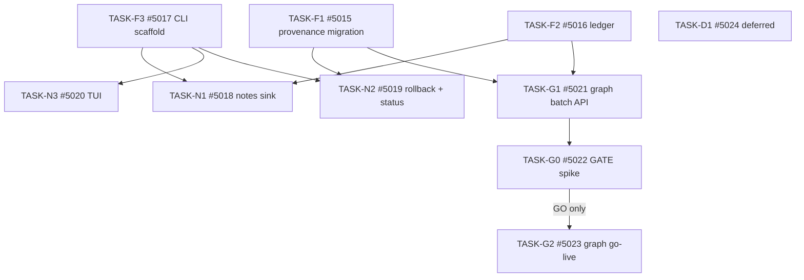

---
aliases:
  - Knowledge Ingest Tasks
tags:
  - tasks
  - memory
  - cross-cutting
created: 2026-06-07
status: draft
spec_id: "067"
related:
  - "[[067-knowledge-ingest/spec]]"
  - "[[067-knowledge-ingest/plan]]"
---

# Developer Tasks: Knowledge Ingest (067)

Each task maps to one GitHub issue and is implementable as a single PR review cycle.
Tasks within each wave are ordered by dependency. A developer should be able to implement one
task per session using `spec.md` and `plan.md` as the implementation contract.

Traceability: each task references the FR/NFR/INV/issue it satisfies.

---

## Progress

- [ ] TASK-F1: Phase 0 provenance migration + recall isolation flag (#5015)
- [ ] TASK-F2: Ingest ledger table + `IngestLedger` repository (#5016)
- [ ] TASK-F3: `zeph knowledge` CLI scaffold + config + `--init` / `--migrate-config` (#5017)
- [ ] TASK-N1: Static artifacts → semantic notes (existing pipeline) (#5018)
- [ ] TASK-N2: `knowledge rollback` + `knowledge status` (#5019)
- [ ] TASK-N3: TUI palette + status spinner (#5020)
- [ ] TASK-G1: Graph batch API + types + technical-document prompt + subagent adapter + dry-run projection (#5021)
- [ ] TASK-G0: Measurement spike GATE — GO / NO-GO decision (#5022)
- [ ] TASK-G2: Graph go-live `--source subagents` + sanitizer on write path (#5023)
- [ ] TASK-D1: DEFERRED — external Claude Code / Codex import (#5024)

---

## Dependency Graph



---

## Wave 1 — Foundation (parallel: F1, F2, F3)

### TASK-F1 — Phase 0 Provenance Migration + Recall Isolation Flag

**GitHub issue:** #5015
**Context:** No graph write may occur without these columns. Every imported edge must carry
`origin`, `import_batch_id`, and `source_uri` so that `rollback` can delete by batch and recall
can optionally down-weight imports. This is the C1 critic blocker baked in as a prerequisite.
**Spec reference:** [[067-knowledge-ingest/spec#FR-001]], [[067-knowledge-ingest/spec#FR-002]],
[[067-knowledge-ingest/spec#FR-003]], [[067-knowledge-ingest/spec#INV-2]], NFR-005, NFR-007
**Acceptance criteria:**
- [ ] Migration file exists in both `sqlite/` and `postgres/` directories and passes `migration_parity.rs`
- [ ] `graph_edges` gains `origin TEXT NOT NULL DEFAULT 'conversation'`, `import_batch_id TEXT`, `source_uri TEXT`
- [ ] `graph_entities` gains `origin TEXT NOT NULL DEFAULT 'conversation'`, `import_batch_id TEXT`
- [ ] All pre-migration rows have `origin = 'conversation'` after backfill
- [ ] `[knowledge].recall_include_imported: bool` field exists in `zeph-config` with `#[serde(default = "true")]`
- [ ] Existing graph integration tests pass against the migrated schema (zero regressions)
- [ ] `cargo nextest run -p zeph-db -p zeph-memory` passes
**Dependencies:** none
**Files:**
- `crates/zeph-db/migrations/sqlite/<NNN>_knowledge_provenance.sql` (new)
- `crates/zeph-db/migrations/postgres/<NNN>_knowledge_provenance.sql` (new)
- `crates/zeph-config/src/knowledge.rs` (`recall_include_imported` field)
**Complexity:** medium

---

### TASK-F2 — Ingest Ledger Table + `IngestLedger` Repository

**GitHub issue:** #5016
**Context:** The content-hash ledger prevents re-reading unchanged inputs and avoids redundant
LLM/embed calls on re-runs. It is a re-read/cost guard only — NOT a drift guard (INV-5 and the
C3 critic blocker). The ledger lives in the same graph DB pool; write volume is low (one row per
document, not per token), so the dedicated-DB-file pattern is not warranted.
**Spec reference:** [[067-knowledge-ingest/spec#FR-012]], [[067-knowledge-ingest/spec#FR-025]],
[[067-knowledge-ingest/spec#INV-5]], NFR-2.4, NFR-4.3, NFR-8.3
**Acceptance criteria:**
- [ ] `knowledge_ingest_ledger` table created with `PRIMARY KEY (source_uri, content_hash)` in both SQLite and Postgres migrations (part of TASK-F1 migration or a separate consecutive one)
- [ ] `IngestLedger` struct in `crates/zeph-memory/src/graph/ingest/ledger.rs` with `is_ingested(uri, hash)` and `mark_ingested(uri, hash, batch_id, entities, edges)` async methods
- [ ] SQL comment and `///` doc comment on `IngestLedger` explicitly state it is a re-read/cost guard, not a drift guard (NFR-8.3)
- [ ] `is_ingested` round-trip unit test passes; `mark_ingested` is idempotent (duplicate `mark` does not error)
- [ ] Ledger query completes in < 5 ms on a 10 000-row table (`criterion` benchmark or timing assertion)
- [ ] `cargo nextest run -p zeph-memory` passes
**Dependencies:** TASK-F1 (migration number must follow)
**Files:**
- `crates/zeph-memory/src/graph/ingest/ledger.rs` (new)
- `crates/zeph-memory/src/graph/ingest/mod.rs` (new, re-exports `IngestLedger`)
- `crates/zeph-memory/src/error.rs` (add `MemoryError::Ingest` variant)
**Complexity:** medium

---

### TASK-F3 — `zeph knowledge` CLI Scaffold + Config + `--init` / `--migrate-config`

**GitHub issue:** #5017
**Context:** The CLI scaffold and config section must land in Wave 1 alongside F1/F2 so that
N1 and N2 have a stable dispatch path to build against. The config section is intentionally
minimal: non-default values only when the user opts in via `--init`.
**Spec reference:** [[067-knowledge-ingest/spec#FR-040]], [[067-knowledge-ingest/spec#FR-041]],
[[067-knowledge-ingest/spec#FR-060]], [[067-knowledge-ingest/spec#FR-061]],
[[067-knowledge-ingest/spec#FR-062]], [[067-knowledge-ingest/spec#FR-070]], NFR-7.1
**Acceptance criteria:**
- [ ] `Command::Knowledge { Ingest { sources, dry_run, max_documents, provider, yes }, Rollback { batch_id }, Status }` added to `src/cli.rs`
- [ ] Dispatch in `src/runner.rs` routes to `src/commands/knowledge.rs` (stub initially returning `Ok(())`)
- [ ] `[knowledge]` config section in `zeph-config/src/knowledge.rs` with all fields `#[serde(default)]`; fields: `ingest_provider`, `concurrency` (3), `max_documents` (0), `recall_include_imported` (true), `transcript_scope` ("current-project")
- [ ] Provider resolution chain implemented: `ingest_provider → extract_provider → primary`; unknown name emits WARN and falls back (FR-041)
- [ ] `--migrate-config` step injects `[knowledge]` with defaults when absent; idempotent on second run (FR-062)
- [ ] `--init` wizard presents `step_knowledge()` offering episode sink toggle and provider choice; emits `[knowledge]` section only on non-default choice (FR-061)
- [ ] Config file without `[knowledge]` loads without error (NFR-7.1 unit test)
- [ ] `zeph knowledge ingest --help` output contains `--dry-run` and `--yes` (NFR-6.2)
- [ ] `cargo nextest run -p zeph-config` passes; `cargo run -- knowledge ingest --help` works
**Dependencies:** none (can land in parallel with F1/F2)
**Files:**
- `src/cli.rs` (modify)
- `src/runner.rs` (modify)
- `src/commands/knowledge.rs` (new, stub)
- `crates/zeph-config/src/knowledge.rs` (new)
- `crates/zeph-config/src/lib.rs` (add `pub mod knowledge`)
- `src/init.rs` (add `step_knowledge`)
- `--migrate-config` module (add migration step)
**Complexity:** large

---

## Wave 2 — Phase 1 Value (N1 first, then N2 + N3 in parallel)

### TASK-N1 — Static Artifacts to Semantic Notes (Existing Pipeline)

**GitHub issue:** #5018
**Context:** This is the highest-value, lowest-risk slice. Static project artifacts (specs,
changelog, handoffs, coverage, git-log) are read from disk, chunked with the existing
`TextLoader`/`TextSplitter`, and fed to the existing `IngestionPipeline` — the same path that
`src/commands/ingest.rs` uses. No graph writes. No new loader. Reuse everything.
**Spec reference:** [[067-knowledge-ingest/spec#FR-010]], [[067-knowledge-ingest/spec#FR-011]],
[[067-knowledge-ingest/spec#FR-012]], [[067-knowledge-ingest/spec#FR-013]],
[[067-knowledge-ingest/spec#FR-014]], [[067-knowledge-ingest/spec#INV-1]], NFR-2.4, NFR-4.2, NFR-6.3
**Acceptance criteria:**
- [ ] `src/commands/knowledge.rs` implements disk-walking for each `--source` kind relative to the current project root
- [ ] Source paths outside the project root are rejected fast with a clear error and zero reads (FR-042, NFR-3.2)
- [ ] `--dry-run` reports: file count, projected chunk count, estimated embedding token cost; writes nothing to Qdrant, graph, or ledger (FR-013)
- [ ] Unchanged inputs are skipped via ledger (FR-012); second run of same source produces zero embed calls (NFR-2.4)
- [ ] Progress events `IngestProgress::{ Ingesting { uri }, Skipped { uri }, Done(report) }` are streamed to CLI status line (FR-014)
- [ ] Confirmation gate (`--yes` or interactive `y/N`) is required before any Qdrant write (FR-040)
- [ ] `TextLoader`/`TextSplitter`/`IngestionPipeline` types from `zeph-memory` are reused verbatim — no duplicate loader (NFR-4.2)
- [ ] Integration test: `--source specs --dry-run` writes nothing; `--source specs --yes` ingests; re-run skips all (ledger hit = 100%)
- [ ] `cargo nextest run -p zeph-memory` and `cargo nextest run --workspace --lib --bins` pass
**Dependencies:** TASK-F2 (ledger), TASK-F3 (CLI dispatch)
**Files:**
- `src/commands/knowledge.rs` (implement notes sink, replace stub)
- `crates/zeph-memory/src/graph/ingest/mod.rs` (re-export `IngestProgress`, `IngestReport`)
**Complexity:** large

---

### TASK-N2 — `knowledge rollback` + `knowledge status`

**GitHub issue:** #5019
**Context:** Rollback gives the operator a safe undo for any graph import batch. It must target
only imported rows (`import_batch_id` column from Phase 0) and must not touch
conversation-origin knowledge. Status provides observability over the ledger.
**Spec reference:** [[067-knowledge-ingest/spec#FR-004]], [[067-knowledge-ingest/spec#FR-029]],
NFR-2.2
**Acceptance criteria:**
- [ ] `zeph knowledge rollback <batch_id>` deletes all `graph_edges` + `graph_entities` rows where `import_batch_id = ?`; orphaned imported entities are also removed
- [ ] Conversation-origin rows (`origin = 'conversation'`) are untouched after rollback
- [ ] Rollback reports deleted edge count and entity count to stdout
- [ ] `zeph knowledge status` lists all import batches from the ledger: `import_batch_id`, source kind, `ingested_at`, entity count, edge count
- [ ] Integration test: ingest a batch; rollback; assert graph row counts match pre-ingest baseline; conversation rows unchanged
- [ ] `cargo nextest run --workspace --lib --bins` passes
**Dependencies:** TASK-F1 (provenance columns), TASK-F3 (CLI dispatch)
**Files:**
- `src/commands/knowledge.rs` (add rollback + status handlers)
- `crates/zeph-memory/src/graph/ingest/ledger.rs` (add `list_batches`, `delete_batch` methods)
**Complexity:** medium

---

### TASK-N3 — TUI Palette + Status Spinner

**GitHub issue:** #5020
**Context:** Per CLAUDE.md TUI rules: any background or implicit operation must have a visible
spinner. Ingest is a foreground operator command but can be long-running; the TUI must show
progress at all times during a write operation.
**Spec reference:** [[067-knowledge-ingest/spec#FR-014]], [[067-knowledge-ingest/spec#FR-071]],
NFR-6.3
**Acceptance criteria:**
- [ ] TUI command palette accepts `/knowledge ingest <source>`, `/knowledge status`, `/knowledge rollback <batch>`
- [ ] During any ingest write, the system status area shows a spinner with `Ingesting knowledge: <uri>...`
- [ ] On completion, the spinner is replaced with a summary line: `Ingest complete: N notes added, M skipped`
- [ ] The spinner is absent when `--dry-run` is active (dry run is fast; a simple progress line is sufficient)
- [ ] Manual test: TUI mode with `--source specs --yes` shows spinner throughout and summary at end
**Dependencies:** TASK-N1 (progress events), TASK-F3 (CLI dispatch)
**Files:**
- `crates/zeph-tui/src/` (relevant command palette + status module)
**Complexity:** medium

---

## Wave 3 — Graph Batch API (G1)

### TASK-G1 — Graph Batch API + Types + Technical-Document Prompt + Subagent Adapter + Dry-Run Projection

**GitHub issue:** #5021
**Context:** This task builds the graph-layer plumbing needed for Phase 2 without activating
the `--source subagents` write path (that is G2). It delivers: the key types, the sealed adapter
trait, the batch extraction method on `SemanticMemory`, the technical-document extraction prompt,
and the hub-degree dry-run projection. The write path is present but unreachable from the binary
until G2 wires it. G0 uses the dry-run projection to make the GO/NO-GO decision.
**Spec reference:** [[067-knowledge-ingest/spec#FR-020]], [[067-knowledge-ingest/spec#FR-023]],
[[067-knowledge-ingest/spec#FR-025]], [[067-knowledge-ingest/spec#FR-026]],
[[067-knowledge-ingest/spec#FR-027]], [[067-knowledge-ingest/spec#FR-028]],
[[067-knowledge-ingest/spec#INV-3]], [[067-knowledge-ingest/spec#INV-4]], NFR-1.1, NFR-4.1, NFR-4.3, NFR-7.3
**Acceptance criteria:**
- [ ] `IngestSourceKind` enum marked `#[non_exhaustive]` with variants `StaticArtifact`, `SubagentTranscript`, `ExternalAgent` (NFR-7.3)
- [ ] `IngestDocument` struct (private fields, valid-by-construction): `content`, `context`, `provenance: Provenance`, `content_hash: blake3::Hash`
- [ ] `Provenance` struct: `kind: IngestSourceKind`, `source_uri: String`, `batch_id: ImportBatchId`
- [ ] `ImportBatchId` newtype over UUID/ULID string
- [ ] Sealed `IngestSourceAdapter` trait with `fn parse(raw: &str) -> Result<Vec<IngestDocument>, MemoryError>` (pure, no async, no I/O)
- [ ] `SubagentJsonl` adapter impl: parses `TranscriptEntry` JSONL lines into `IngestDocument`s; malformed lines are skipped with a WARN, not an error (spec §6)
- [ ] Second `const` technical-document extraction prompt in `extractor.rs` selectable by `IngestSourceKind` (FR-023)
- [ ] `SemanticMemory::ingest_documents()` with signature per spec §2.3: ledger check → `buffer_unordered(concurrency)` → `extract_and_store()` reuse → `mark_ingested`; collect-errors fail strategy
- [ ] Dry-run path: hub-degree projection report (top-N entities by degree, total edges projected) returned in `IngestReport` (FR-026)
- [ ] `TODO(critic D1)` and `TODO(critic D2)` deferred markers placed at `ExternalAgent` arm and `ingest_documents` respectively (spec §9)
- [ ] All public types have `///` doc comments; `ingest_documents` has `# Examples` with `no_run` (NFR-4.4)
- [ ] `cargo nextest run -p zeph-memory` passes; `cargo check -p zeph-memory` must not pull `zeph-subagent` (NFR-4.1)
**Dependencies:** TASK-F1 (provenance columns), TASK-F2 (ledger)
**Files:**
- `crates/zeph-memory/src/graph/ingest/mod.rs` (key types)
- `crates/zeph-memory/src/graph/ingest/adapter.rs` (sealed trait + `SubagentJsonl`)
- `crates/zeph-memory/src/graph/ingest/ledger.rs` (extend with batch methods)
- `crates/zeph-memory/src/graph/extractor.rs` (add technical-document prompt)
- `crates/zeph-memory/src/semantic/graph.rs` (add `ingest_documents`)
- `crates/zeph-memory/src/error.rs` (confirm `MemoryError::Ingest`)
**Complexity:** extra-large

---

## Wave 4 — Measurement Spike GATE (G0)

### TASK-G0 — Measurement Spike + Kill-Criterion Decision

**GitHub issue:** #5022
**Context:** This is a research / operator task, not a code task. The developer runs `--dry-run`
over the representative corpus, measures the three thresholds defined in spec §7, records the
evidence, and makes the GO/NO-GO decision. If NO-GO, G2 is closed as abandoned and
`--source subagents` is rerouted to the Phase 1 notes pipeline.
**Spec reference:** [[067-knowledge-ingest/spec#§7]], FR-050..FR-053
**Acceptance criteria:**
- [ ] `--dry-run --source subagents` runs over the current-project transcript corpus (requires G1 dry-run projection)
- [ ] 3 concrete multi-hop recall queries authored; recall@5 measured: graph path vs. notes baseline on ≥ 10 held-out cross-session questions (FR-050)
- [ ] Hub-degree distribution checked: no entity accounts for > 15% of projected edges (FR-051)
- [ ] Signal-to-noise checked: ≥ 50% of projected edges are non-trivial (FR-052)
- [ ] Decision (GO / NO-GO) and supporting evidence recorded in `.local/testing/playbooks/knowledge-ingest.md`
- [ ] If NO-GO: G2 #5023 closed with reason "§7 kill-criterion: <which threshold failed>"; `--source subagents` added to Phase 1 notes pipeline (new sub-task of N1)
- [ ] If GO: G2 #5023 opened for implementation
**Dependencies:** TASK-G1 (dry-run projection), TASK-N1 (notes baseline for comparison)
**Files:**
- `.local/testing/playbooks/knowledge-ingest.md` (spike results section)
**Complexity:** medium

---

## Wave 5 — Graph Go-Live (G2, conditional on G0 GO)

### TASK-G2 — Graph Go-Live `--source subagents` + Sanitizer on Write Path

**GitHub issue:** #5023
**Context:** Activates the full graph write path for subagent transcripts. Wires
`--source subagents` in the binary command to `SemanticMemory::ingest_documents()`. Enforces
the sanitizer, write-quality gate, and admission control on every candidate edge (C2 and S4
critic blockers). Provenance stamping is tested end-to-end.
**Spec reference:** [[067-knowledge-ingest/spec#FR-020..FR-028]], [[067-knowledge-ingest/spec#INV-3]],
[[067-knowledge-ingest/spec#INV-4]], NFR-3.1, NFR-3.3, NFR-2.2
**Acceptance criteria:**
- [ ] `src/commands/knowledge.rs`: `--source subagents` reads `TranscriptEntry` JSONL from `transcript_dir`; JSONL reading and disk discovery happen here (binary level), not in `zeph-memory` (INV-4.1)
- [ ] `PostExtractValidator` is wired to `zeph-sanitizer`'s PII/exfiltration validator (FR-022, INV-4)
- [ ] Write-quality gate (004-9) and admission control (004-3) mocks are invoked once per candidate edge in tests (FR-021, INV-3)
- [ ] Every created `graph_edges` row has `origin = 'subagent'` and a non-null `import_batch_id` (FR-024)
- [ ] `rollback <batch>` after a successful import removes all tagged rows; conversation rows untouched (NFR-2.2)
- [ ] Sanitizer rejection: document with synthetic PII pattern produces `IngestReport.dropped > 0` and zero entity writes (NFR-3.1, NFR-8.2)
- [ ] Integration test covering the full write-rollback cycle (NFR-2.2)
- [ ] `cargo nextest run --workspace --lib --bins` passes; pre-merge checks pass
**Dependencies:** TASK-G0 (GO decision), TASK-N2 (rollback infra)
**Files:**
- `src/commands/knowledge.rs` (add `--source subagents` handler)
- `crates/zeph-memory/src/semantic/graph.rs` (`ingest_documents` wired to sanitizer)
**Complexity:** large

---

## Deferred

### TASK-D1 — External Claude Code / Codex Transcript Import

**GitHub issue:** #5024
**Context:** Deferred due to undocumented/unstable external schemas (critic S3), cross-project
privacy blast radius (critic S4), and the requirement for a version-pinned strict allowlist
parser. A `TODO(critic D1)` marker in `IngestSourceKind::ExternalAgent` documents the conditions
that must be met before this task is actionable.
**Spec reference:** [[067-knowledge-ingest/spec#§9]], spec §5 (NEVER items)
**Acceptance criteria (when undeferred):**
- [ ] Phase 0 provenance in production
- [ ] Write-path PII redaction closed (pre-1.0 limitation resolved)
- [ ] Version-pinned strict allowlist parser for Claude Code / Codex schemas (accept only `type == "user"/"assistant"` + `message.role`; fail loud on unknown schema)
- [ ] Current-project scope enforcement via path allowlist
**Dependencies:** TASK-G2 (graph write path stable), write-path PII redaction (tracked separately)
**Files:** TBD at time of activation
**Complexity:** extra-large

---

## Cross-Cutting Tasks (all phases)

### TASK-X1 — Testing Playbook + Coverage-Status Rows

**Files:**
- `.local/testing/playbooks/knowledge-ingest.md` (main repo)
- `.local/testing/coverage-status.md` (main repo)

**What:** Per CLAUDE.md dev-rules points 6 and 7 (mandatory before PR):
1. Write `knowledge-ingest.md` playbook with scenarios covering: notes sink dry-run, notes sink
   write + re-run idempotency, rollback end-to-end, sanitizer rejection, provider resolution
   (valid + unknown name), source-outside-root rejection, `--source subagents` dry-run
   (G0 spike evidence), and TUI spinner visibility. Minimum 12 numbered scenarios.
2. Add rows to `coverage-status.md` with `Status = Untested` for: notes sink, graph sink,
   rollback, ledger, dry-run (notes + graph), sanitizer-on-write, provider resolution, TUI
   spinner.

**Acceptance:** Playbook has ≥ 12 numbered scenarios with expected outcomes; coverage-status
has ≥ 8 new rows.
**Dependencies:** TASK-N1, TASK-G0 (spike evidence section)

---

### TASK-X2 — Doc Comments + Rustdoc Verification

**Files:** All new public items in `zeph-memory` and `zeph-config`

**What:** Ensure all `pub` types, traits, and methods introduced by this feature have `///`
doc comments; `SemanticMemory::ingest_documents` and `IngestLedger` include `# Examples`
with `no_run` doc-tests (NFR-4.4).

**Acceptance:**
`RUSTDOCFLAGS="--deny rustdoc::broken_intra_doc_links" cargo doc --no-deps -p zeph-memory --all-features` passes with zero warnings.

---

### TASK-X3 — CHANGELOG.md Update

**Files:** `CHANGELOG.md`

**What:** Add to the `[Unreleased]` section at end of each wave merge:

Wave 1/2 entry:
```
### Added
- `zeph knowledge ingest --source <SRC>` command for seeding project knowledge into semantic notes (#5012)
- `zeph knowledge rollback <batch>` and `zeph knowledge status` for import management (#5019)
- `[knowledge]` config section with `ingest_provider`, `concurrency`, `max_documents`, `recall_include_imported`
- Phase 0: provenance columns (`origin`, `import_batch_id`, `source_uri`) on `graph_edges` and `graph_entities` (#5015)
- Content-hash ledger for idempotent ingest re-runs (#5016)
- TUI command palette entries for knowledge ingest (#5020)
```

Wave 5 entry (if G0 GO):
```
### Added
- `zeph knowledge ingest --source subagents` — subagent episode extraction to knowledge graph (gated, #5023)
```

---

### TASK-X4 — Register Spec 067 in `specs/README.md`

**Files:** `specs/README.md`

**What:** Add the spec-067 entry to the Feature Docs table:

```
| `067-knowledge-ingest/spec.md` | Knowledge ingest command — static artifacts → semantic notes; subagent episodes → graph (gated §7); two-sink design, rollback, ledger | `zeph-memory`, `zeph-config`, `zeph-db`, binary |
```

---

## Implementation Notes

### Order of execution
Wave 1 tasks (F1, F2, F3) are fully parallel — they touch disjoint files. Wave 2 (N1, N2, N3)
requires Wave 1 to complete; N2 and N3 can run in parallel after N1 merges. G1 requires F1+F2.
G0 requires G1+N1 (needs the dry-run projection and the notes baseline). G2 requires G0 GO.
D1 is entirely deferred.

### Reuse patterns
- Notes sink: copy the `IngestionPipeline` invocation pattern from `src/commands/ingest.rs`
  verbatim; only the source-walking and progress loop are new.
- Graph extraction: call `extract_and_store()` unchanged inside `ingest_documents()`; it does
  not contain RPE. Threading `Provenance` through to the edge writer is the only addition.
- Provider resolution: copy the `resolve_background_provider` call pattern from
  `crates/zeph-memory/src/graph/extractor.rs`.

### Gotchas
- `graph_edges` has 5+ indexes; the `ALTER TABLE` migration is additive (nullable columns do
  not rebuild existing indexes in SQLite). Test on a production-sized DB before merging F1.
- `extract_and_store()` is an `async fn` that performs I/O (LLM + DB). Do not call it inside a
  synchronous context; always `await` inside the `buffer_unordered` stream.
- The ledger's `PRIMARY KEY (source_uri, content_hash)` is intentional: the same file at a
  different hash (i.e. changed content) gets a new row and will be re-ingested.
- `IngestSourceAdapter::parse` must be pure (no async, no I/O) to satisfy NFR-4.1. JSONL file
  reading happens upstream in the binary command, not inside the adapter.
- The technical-document prompt (TASK-G1) must not drop file paths and tool names — these are
  the entities that matter for project-decision knowledge. Verify with `--dry-run` over 10 specs
  before G0 to confirm S/N > 50%.

## See Also

- [[067-knowledge-ingest/spec]] — technical specification and invariants
- [[067-knowledge-ingest/plan]] — implementation plan, phases, risk register
- [[004-memory/spec]] — memory subsystem
- [[004-memory/004-9-memory-write-gate]] — write-quality gate (must not be bypassed)
- [[041-sanitizer/spec]] — PII/exfiltration validators
- [[001-system-invariants/spec]] — system contracts (INV-1 dependency direction)
