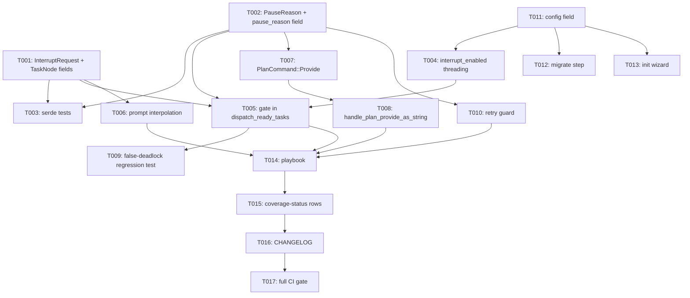

---
aliases:
  - Orchestration HITL Interrupt Tasks
  - Tasks 073
tags:
  - sdd
  - tasks
  - orchestration
created: 2026-07-13
status: draft
related:
  - "[[074-orchestration-hitl-interrupt/spec]]"
  - "[[074-orchestration-hitl-interrupt/plan]]"
---

# Implementation Tasks 073 — Declarative Task-Level HITL Interrupt

One PR. Tasks are ordered by dependency; T-001..T-004 (data model) block nearly everything else.

---

## Progress

- [ ] T-001: `InterruptRequest` struct + `TaskNode` fields
- [ ] T-002: `PauseReason` enum + `TaskGraph.pause_reason` field
- [ ] T-003: Backward-compat / serde round-trip tests
- [ ] T-004: `DagScheduler.interrupt_enabled` field + config threading
- [ ] T-005: Interrupt gate in `dispatch_ready_tasks`
- [ ] T-006: Prompt interpolation in `build_task_prompt`
- [ ] T-007: `PlanCommand::Provide` + parser
- [ ] T-008: `handle_plan_provide_as_string`
- [ ] T-009: False-deadlock regression test (highest priority test)
- [ ] T-010: `/plan retry` guard on `AwaitingInput` pause
- [ ] T-011: `OrchestrationConfig.interrupt_enabled`
- [ ] T-012: `--migrate-config` step 86
- [ ] T-013: `--init` wizard prompt
- [ ] T-014: Live testing playbook
- [ ] T-015: Coverage-status rows
- [ ] T-016: CHANGELOG.md entry
- [ ] T-017: Full CI gate pass

---

## Dependency Graph

---

### T-001: `InterruptRequest` struct + `TaskNode` fields

**Context**: Foundation data type for the gate; everything else reads/writes these fields.
**Spec reference**: [[074-orchestration-hitl-interrupt/spec#3.2 Data Model]]
**Acceptance criteria**:
- [ ] `InterruptRequest { prompt: String, schema: Option<serde_json::Value> }` added to `graph.rs`
      with `#[derive(Debug, Clone, Serialize, Deserialize)]`
- [ ] `TaskNode.interrupt_before: Option<InterruptRequest>` and `TaskNode.resolved_input:
      Option<serde_json::Value>` added, both `#[serde(default, skip_serializing_if =
      "Option::is_none")]`
- [ ] `TaskNode::new` struct literal (and any other exhaustive `TaskNode { .. }` construction site)
      updated to include the two new fields as `None`
- [ ] Existing `TaskNode` module doc-test extended with `assert!(node.interrupt_before.is_none())`
- [ ] `cargo doc --no-deps -p zeph-orchestration` passes (doc-test included)
**Dependencies**: none
**Files**: `crates/zeph-orchestration/src/graph.rs`
**Complexity**: low

---

### T-002: `PauseReason` enum + `TaskGraph.pause_reason` field

**Context**: Disambiguates why a graph is `Paused` without adding a new `GraphStatus` variant.
**Spec reference**: [[074-orchestration-hitl-interrupt/spec#3.2 Data Model]], [[074-orchestration-hitl-interrupt/spec#3.3 ALT-1 (blob-only) chosen over DurablePromise for Phase 1]]
**Acceptance criteria**:
- [ ] `#[non_exhaustive] enum PauseReason { AwaitingInput { task_id: TaskId, prompt: String,
      promise_id: Option<zeph_durable::PromiseId> } }` added, `#[serde(rename_all = "snake_case",
      tag = "kind")]`, `promise_id` field `#[serde(default, skip_serializing_if =
      "Option::is_none")]`
- [ ] `TaskGraph.pause_reason: Option<PauseReason>` added, `#[serde(default, skip_serializing_if =
      "Option::is_none")]`
- [ ] `zeph_durable::PromiseId` import added to `graph.rs` (no new Cargo dependency edge — already
      a workspace dependency of `zeph-orchestration`)
**Dependencies**: none
**Files**: `crates/zeph-orchestration/src/graph.rs`
**Complexity**: low

---

### T-003: Backward-compat / serde round-trip tests

**Context**: Old graph blobs (pre-073) must deserialize unchanged; this is the load-bearing
compatibility guarantee for every persisted graph in production.
**Spec reference**: [[074-orchestration-hitl-interrupt/spec#4. Key Invariants]] (Always, bullet 1)
**Acceptance criteria**:
- [ ] Test: a JSON blob without `interrupt_before`/`resolved_input`/`pause_reason` keys
      deserializes to `TaskNode`/`TaskGraph` with all three as `None` (extends the existing test
      block at `graph.rs:989-1065` following the `network_scope`/`asset_sensitivity` pattern)
- [ ] Test: round-trip serialize → deserialize for `InterruptRequest` and both `PauseReason`
      variants' JSON shape (including `promise_id` present and absent)
- [ ] Test: a graph with `pause_reason = None` and `status = Paused` (simulating a legacy `Ask`
      pause) round-trips correctly and is distinguishable in behavior only by the `None`
**Dependencies**: T-001, T-002
**Files**: `crates/zeph-orchestration/src/graph.rs` (test module)
**Complexity**: low

---

### T-004: `DagScheduler.interrupt_enabled` field + config threading

**Context**: The gate must be a runtime-configurable opt-in, not always-on, so headless/gateway
deployments are unaffected by default.
**Spec reference**: [[074-orchestration-hitl-interrupt/spec#3.8 Config]]
**Acceptance criteria**:
- [ ] `DagScheduler` gains an `interrupt_enabled: bool` field
- [ ] `DagScheduler::new` and `resume_from` accept and store it
- [ ] `build_dag_scheduler` (`zeph-core/src/agent/plan.rs:164`) reads
      `self.config_for_orchestration().interrupt_enabled` and passes it through
**Dependencies**: T-011 (config field must exist first, but can be developed in parallel and
merged in the same commit — sequencing matters only for compile order within the PR)
**Files**: `crates/zeph-orchestration/src/scheduler/mod.rs`, `crates/zeph-core/src/agent/plan.rs`
**Complexity**: low

---

### T-005: Interrupt gate in `dispatch_ready_tasks`

**Context**: The core scheduling behavior change — this is where the pause actually fires.
**Spec reference**: [[074-orchestration-hitl-interrupt/spec#3.4 Data Flow]] step 1, FR-001..FR-004
**Acceptance criteria**:
- [ ] Inside the `for task_id in ready` loop in `dispatch_ready_tasks`
      (`scheduler/tick/mod.rs`), before the sequential-execution check: if `interrupt_enabled &&
      task.interrupt_before.is_some() && task.resolved_input.is_none()`, set `graph.status =
      Paused`, `graph.pause_reason = Some(AwaitingInput{task_id, prompt, promise_id: None})`,
      `graph_dirty = true`, and `break`
- [ ] `task.status` is explicitly NOT mutated by this branch (verified by T-009)
- [ ] Test: earlier-in-list `Ready` tasks dispatched before the gate is hit keep their
      `Spawn`/`RunInline` actions (FR-003)
- [ ] Test: `interrupt_enabled = false` → gate never fires regardless of `interrupt_before`
      (FR-002)
- [ ] Test: `resolved_input.is_some()` → gate does not re-fire, task dispatches normally
**Dependencies**: T-001, T-002, T-004
**Files**: `crates/zeph-orchestration/src/scheduler/tick/mod.rs`
**Complexity**: medium

---

### T-006: Prompt interpolation in `build_task_prompt`

**Context**: Delivers the operator's answer to the sub-agent — the actual "resume with value"
half of the parity story.
**Spec reference**: [[074-orchestration-hitl-interrupt/spec#3.5 Prompt Interpolation (FR-008)]]
**Acceptance criteria**:
- [ ] When `task.resolved_input.is_some()`, append the delimited "Human-provided input" section
      to the built prompt (string case: verbatim; other JSON: pretty-printed)
- [ ] Test: `Value::String("answer")` renders verbatim, no JSON quoting
- [ ] Test: `Value::Object(..)` renders pretty-printed JSON
- [ ] Test: `resolved_input = None` → prompt unchanged from today's output (no regression)
**Dependencies**: T-001
**Files**: `crates/zeph-orchestration/src/scheduler/router.rs`
**Complexity**: low

---

### T-007: `PlanCommand::Provide` + parser

**Context**: New command surface for the operator to answer a pending interrupt.
**Spec reference**: [[074-orchestration-hitl-interrupt/spec#7. Open Questions]] (OQ-3 resolution)
**Acceptance criteria**:
- [ ] `PlanCommand::Provide(String)` variant added
- [ ] `PlanCommand::parse()` recognizes `/plan provide <rest>` and captures the entire
      outer-trimmed remainder as the value (no further tokenization — value may contain spaces or
      be raw JSON)
- [ ] Test: `/plan provide hello world` → `Provide("hello world")`
- [ ] Test: `/plan provide {"key": "value"}` → `Provide("{\"key\": \"value\"}")`
- [ ] Test: `/plan provide` (no value) → parse error (empty value is invalid)
**Dependencies**: none (independent of T-001/T-002, can run in parallel)
**Files**: `crates/zeph-orchestration/src/command.rs`
**Complexity**: low

---

### T-008: `handle_plan_provide_as_string`

**Context**: The command handler that actually resolves the gate — the only code path permitted
to mutate `resolved_input`/`pause_reason`.
**Spec reference**: [[074-orchestration-hitl-interrupt/spec#3.4 Data Flow]] step 4, FR-005, FR-006
**Acceptance criteria**:
- [ ] Handler added next to `handle_plan_retry_as_string` (`plan.rs:1211`): validates active
      `pending_graph` exists and `pause_reason == Some(AwaitingInput{task_id,..})`; parses value as
      JSON, falls back to `Value::String`; sets `resolved_input`, clears `pause_reason`; persists
      immediately via `graph_persistence.save` if enabled (warn-log, non-fatal, on persistence
      failure); re-parks `pending_graph`
- [ ] Wired into `handle_plan_command_as_string` (`plan.rs:1282`) and the `zeph-commands`
      handler registry
- [ ] Test: success path — `resolved_input` set, `pause_reason` cleared, persistence called
- [ ] Test: no active `pending_graph` → rejection message (FR-006)
- [ ] Test: active graph not `Paused`/`AwaitingInput` → rejection message naming actual state
      (FR-006)
- [ ] Test: malformed-JSON value → falls back to plain string, no error (FR-005)
- [ ] Test: persistence disabled → handler still succeeds (in-memory only), no panic
**Dependencies**: T-002, T-007
**Files**: `crates/zeph-core/src/agent/plan.rs`, `crates/zeph-commands/src/handlers/plan.rs`
**Complexity**: medium

---

### T-009: False-deadlock regression test (highest priority test in this PR)

**Context**: `check_graph_completion` (`scheduler/planner.rs:105`) declares deadlock+`Failed`
when there are zero running tasks, not all tasks are terminal, and `dag::ready_tasks()` is empty.
Because the interrupt gate deliberately leaves the gated task's `TaskStatus` as `Ready`, this
branch must NOT fire — but this is a subtle invariant that a future refactor could silently break.
**Spec reference**: [[074-orchestration-hitl-interrupt/spec#3.4 Data Flow]] step 2, [[074-orchestration-hitl-interrupt/spec#4. Key Invariants]] (Always, bullet 3), [[074-orchestration-hitl-interrupt/plan#2.3 scheduler/planner.rs::check_graph_completion — verification only, no code change expected]]
**Acceptance criteria**:
- [ ] Test: single-task graph, `interrupt_before` set, `interrupt_enabled = true`. Call `tick()`
      once. Assert `graph.status == Paused` (NOT `Failed`), `pause_reason ==
      Some(AwaitingInput{..})`, and the task's own status is still `Ready`
- [ ] Test: two-task independent (no dependency) graph, one task interrupt-gated, the other
      plain. Call `tick()` once. Assert the plain task's `Spawn`/`RunInline` action IS emitted
      (FR-003), the gated task is NOT dispatched, `graph.status == Paused`, and — critically — the
      plain task's status is NOT `Canceled` (proves the deadlock branch did not fire and cancel
      everything)
- [ ] Test: explicit assertion that `dag::ready_tasks(&graph)` called after the pausing `tick()`
      still contains the gated task's `TaskId` (documents the mechanism, not just the outcome)
**Dependencies**: T-005
**Files**: `crates/zeph-orchestration/src/scheduler/planner.rs` or `tick/mod.rs` (test module,
whichever hosts the most relevant existing scheduler test fixtures)
**Complexity**: medium

---

### T-010: `/plan retry` guard on `AwaitingInput` pause

**Context**: Without this, `/plan retry` would call `reset_for_retry` on an interrupt-paused
graph and re-dispatch the gated task without the operator's value — a silent human-gate bypass.
**Spec reference**: [[074-orchestration-hitl-interrupt/spec#4. Key Invariants]] (Never, bullet 1), FR-009
**Acceptance criteria**:
- [ ] `handle_plan_retry_as_string` (`plan.rs:1234` gate check) rejects when `graph.pause_reason
      == Some(AwaitingInput{..})`, with a message directing the operator to `/plan provide` first,
      and does NOT call `reset_for_retry`
- [ ] Existing retry behavior for `Failed` graphs and legacy `Ask` pauses (`pause_reason == None`)
      is unchanged — regression test confirming this
- [ ] Test: retry on `AwaitingInput` pause → rejected, `reset_for_retry` not invoked (verify via
      the graph's task statuses being unchanged, not reset to `Ready`)
**Dependencies**: T-002
**Files**: `crates/zeph-core/src/agent/plan.rs`
**Complexity**: low

---

### T-011: `OrchestrationConfig.interrupt_enabled`

**Context**: Config surface for the opt-in toggle.
**Spec reference**: [[074-orchestration-hitl-interrupt/spec#3.8 Config]]
**Acceptance criteria**:
- [ ] `interrupt_enabled: bool` added to `OrchestrationConfig`
      (`crates/zeph-config/src/experiment.rs:261`), `#[serde(default)]` → `false`
- [ ] Doc comment cites spec 073 / #5918
**Dependencies**: none
**Files**: `crates/zeph-config/src/experiment.rs`
**Complexity**: low

---

### T-012: `--migrate-config` step 86

**Context**: Existing configs must gain the new field with its safe default without manual
editing (CLAUDE.md Development Rules point 5).
**Spec reference**: [[074-orchestration-hitl-interrupt/spec#2. Functional Requirements]] FR-012
**Acceptance criteria**:
- [ ] New `Migration` impl added to `crates/zeph-config/src/migrate/steps.rs`, inserting
      `interrupt_enabled = false` into `[orchestration]`
- [ ] Registered in `MIGRATIONS` (`migrate/mod.rs:646`)
- [ ] `migrate/tests.rs:1784` count assertion updated `85` → `86`; name list at `:1789` updated
- [ ] Test: running the migration on a pre-073 `[orchestration]` section adds the field without
      disturbing existing keys/comments
**Dependencies**: T-011
**Files**: `crates/zeph-config/src/migrate/steps.rs`, `crates/zeph-config/src/migrate/mod.rs`,
`crates/zeph-config/src/migrate/tests.rs`
**Complexity**: low

---

### T-013: `--init` wizard prompt

**Context**: New users configuring orchestration from scratch should be able to opt in without
hand-editing TOML (CLAUDE.md Development Rules point 4).
**Spec reference**: [[074-orchestration-hitl-interrupt/plan#6. --init Wizard (src/init/agents.rs::step_orchestration)]]
**Acceptance criteria**:
- [ ] `step_orchestration` (`src/init/agents.rs`) adds a yes/no prompt, default `No`, with wording
      that flags this as advanced/requires an interactive operator
- [ ] `orchestration_interrupt_enabled: bool` added to the wizard `State` struct
      (`src/init/mod.rs`) and threaded into the final `OrchestrationConfig` assembly
- [ ] `--init` produces a `config.toml` with `interrupt_enabled = false` when the prompt is
      declined (default path), `true` when accepted
**Dependencies**: T-011
**Files**: `src/init/agents.rs`, `src/init/mod.rs`
**Complexity**: low

---

### T-014: Live testing playbook

**Context**: Mandatory per CLAUDE.md Development Rules point 6 — primary reference for the next
CI cycle testing this feature.
**Spec reference**: N/A (process requirement)
**Acceptance criteria**:
- [ ] `.local/testing/playbooks/orchestration-hitl-interrupt.md` created (main repo path, per
      `.claude/rules/continuous-improvement.md` artifact-path convention) with concrete scenarios:
      declarative interrupt pause + resume with a string value; resume with a JSON value; retry
      rejected on an interrupt pause; cancel on an interrupt pause; crash-resume via graph blob
      rehydration (kill the process between pause and `/plan provide`, and again between
      `/plan provide` and `/plan confirm`); sibling-task draining under a multi-task graph where
      one task is gated and another is already running; backward-compat load of a pre-073 graph
      blob
- [ ] Each scenario has expected outcome and how to verify (log lines, `/plan status` output,
      graph blob inspection)
**Dependencies**: T-005, T-006, T-008, T-010 (needs the feature working end-to-end to write
concrete steps)
**Files**: `.local/testing/playbooks/orchestration-hitl-interrupt.md` (main repo, not worktree)
**Complexity**: low

---

### T-015: Coverage-status rows

**Context**: Mandatory per CLAUDE.md Development Rules point 7.
**Spec reference**: N/A (process requirement)
**Acceptance criteria**:
- [ ] Row(s) added to `/Users/rabax/Dev/zeph/.local/testing/coverage-status.md` (main repo path)
      for the new interrupt-gate functional block, status `Untested`, linking to the playbook from
      T-014
**Dependencies**: T-014
**Files**: `.local/testing/coverage-status.md` (main repo, not worktree)
**Complexity**: low

---

### T-016: CHANGELOG.md entry

**Context**: Mandatory per CLAUDE.md Project Management rules.
**Spec reference**: N/A (process requirement)
**Acceptance criteria**:
- [ ] `[Unreleased]` section gains an entry describing the declarative HITL interrupt gate,
      `/plan provide` command, and `interrupt_enabled` config toggle, referencing #5918
**Dependencies**: T-015
**Files**: `CHANGELOG.md`
**Complexity**: low

---

### T-017: Full CI gate pass

**Context**: Final acceptance gate before PR open, per `.claude/rules/branching.md`.
**Spec reference**: [[074-orchestration-hitl-interrupt/spec#6. Success Criteria]]
**Acceptance criteria**:
- [ ] `cargo +nightly fmt --check`
- [ ] `cargo clippy --profile ci --workspace --all-targets --features
      "desktop,ide,server,chat,pdf,scheduler,testing" -- -D warnings`
- [ ] `cargo nextest run --config-file .github/nextest.toml --workspace --features
      "desktop,ide,server,chat,pdf,scheduler" --lib --bins`
- [ ] `RUSTFLAGS="-D warnings" RUSTDOCFLAGS="--deny rustdoc::broken_intra_doc_links" cargo doc
      --no-deps --workspace --features "desktop,ide,server,chat,pdf,scheduler"`
- [ ] `cargo test --doc --workspace --features "desktop,ide,server,chat,pdf,scheduler"`
- [ ] `gitleaks protect --staged --no-banner --redact`
- [ ] Re-run the `tokio::spawn` scan (`.claude/rules/continuous-improvement.md`) — count must not
      increase from the last recorded baseline
**Dependencies**: T-001 through T-016
**Files**: N/A (verification only)
**Complexity**: low

---

## Implementation Notes

### Order of execution

Data model (T-001, T-002) first — everything else reads these types. T-005 (scheduler gate) and
T-009 (its regression test) are the highest-risk pair; do not consider the PR mergeable without
T-009 passing. T-007/T-008 (command surface) can be developed in parallel with T-005/T-006 once
T-002 lands. Config/init/migrate (T-011..T-013) are independent and can be parallelized with
everything else once T-011 exists (T-004 needs the config field name decided, not the full PR
merged). Process tasks (T-014..T-016) come last, after the feature is demonstrably working.

### Common patterns

Follow the `network_scope`/`asset_sensitivity` precedent throughout for serde attributes on new
optional `TaskNode` fields — do not invent a different pattern. Follow
`handle_plan_retry_as_string`'s borrow-then-take structure for `handle_plan_provide_as_string`.

### Gotchas

- **Never mutate the gated task's `TaskStatus`** in the gate logic (T-005) — this is the single
  most important correctness constraint in this feature (see T-009).
- `PauseReason` is not `Copy` (`String` field) — match on a reference or clone deliberately, do not
  reach for `.take()` before you've extracted what you need from the borrowed graph.
- The `promise_id` field on `AwaitingInput` is always `None` in this PR — do not wire up
  `DurablePromise` minting/storing/resolving; that is explicitly out of scope (see spec.md §7 Out
  of Scope).

## See Also

- [[074-orchestration-hitl-interrupt/spec]] — feature specification
- [[074-orchestration-hitl-interrupt/plan]] — technical plan
- [[MOC-specs]] — all specifications
